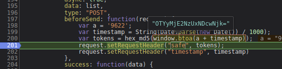
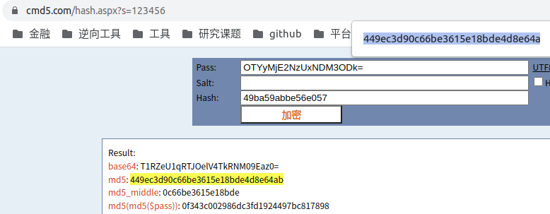

# 知识点：全局搜索定位参数，加密逻辑是否原身

1. 全局搜索`safe`加密字段，发现

发现加密代码逻辑应该是`md5`,参数是时间戳 + 9622

    var a = '9622';
    var timestamp = String(Date.parse(new Date()) / 1000);
    var tokens = hex_md5(window.btoa(a + timestamp));

遇到这样的情况，不要去扣代码，先用线上的加密平台去尝试破解，这里我用的是

    https://www.cmd5.com/hash.aspx?s=123456

复制明文,查看加密后的结果

发现存在加密结果