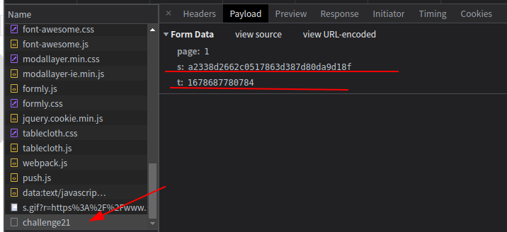
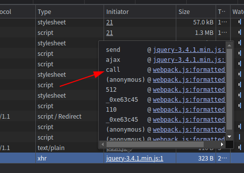
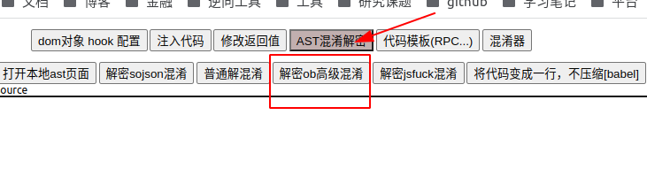
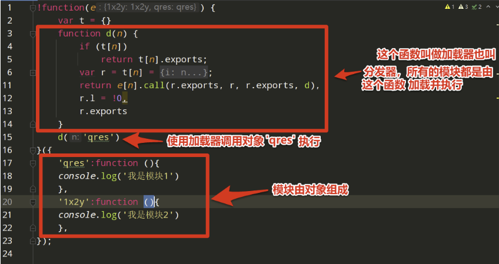
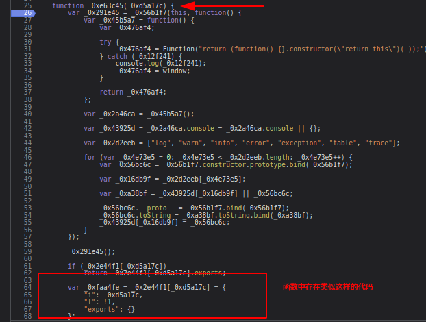
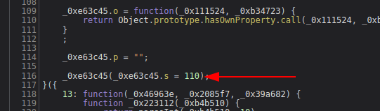
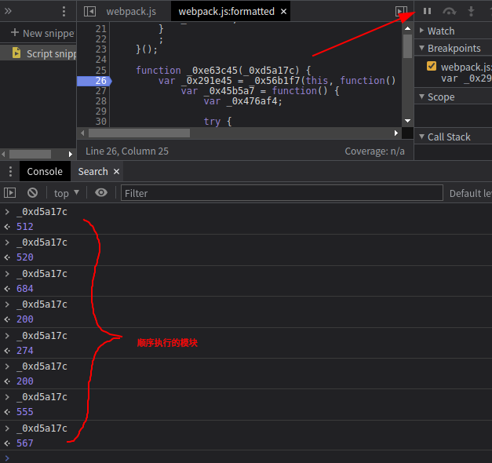
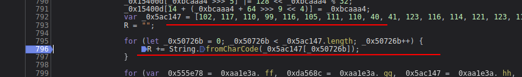
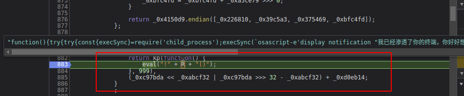
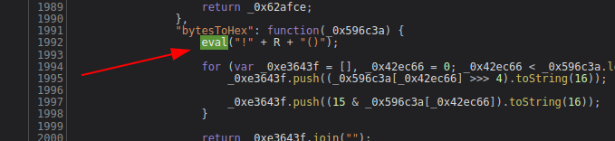

# 知识点：webpack4，魔改的md5，eval渗透，AC表转字符串

## 解题思路

    https://blog.csdn.net/qq523176585/article/details/124722785
    https://app.yinxiang.com/fx/970ae39c-9964-4aae-aa96-7e81fee4ef8f
    js基础课的webpack

查看请求地址，发现存在`s`加密变量和`t`变量

断点进入

个人习惯都，先解混淆，在`reres`替换文件

`reres`替换成本地文件

断点进入代码，了解过webpack打包的，就不难发现这段代码是webpack4的打包

webpack打包后的基本结构

想要调试webpack代码，只需要在分发器上打上断点，就能知道运行的哪些模块

刷新页面，第一个加载的模块是`110`，查看代码也符合预期，这里初始执行的模块就是`110`

继续断点执行，并每次执行后打印模块名，可以发现模块执行顺序是`512，520，684，200，274，200，555，567`

就是说整个加密过程经历了`512，520，684，200，274，200，555，567`模块

如何扣webpack代码，类似如下

    window = global;
    p = window;
    var getToken;

    !function (_0x33909e) {
        var t={}

        // 分发器
        function d(n){
            if (t[n])
                return t[n].exports;
            console.log(n)
            var r = t[n] = {
                i:n,
                l:!1,
                exports:{}
                };
            return e[n].call(r.exports,r,r.exports,d),
            r.l = !0;
            r.exports
        }

        // d(1)
        getToken = d;  // 导出执行入口函数
    }({
        // 模块
        520: function (_0x30cc03, _0x3b380c, _0x3f415a) {},
        684: function (_0x41d8d5, _0x220a8e) {},
        200: function (_0xd2ef5e, _0x515626) {},
        274: function (_0x4dc078, _0x4f5a3) {},
        555: function (_0x71207c, _0x1e06ab, _0x4c8811) {},
        567: function (_0x244241, _0x257cd8, _0x4d003a) {},
    });

    // 函数外执行
    var k = getToken(520);
    let _0x4d0a2e = k();
    console.dir(_0x4d0a2e);

将入口函数`d`赋值给全局变量`getToken`，将需要执行的函数复制粘贴到模块中，在函数外给到需要执行的模块，最后得到想要的值

## 注意点

利用AC表插入一断危险代码

并执行一断定时任务

类似的地方还有一处

