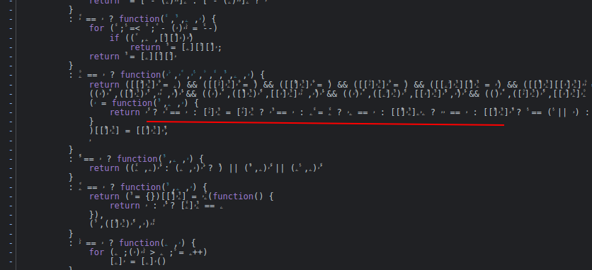
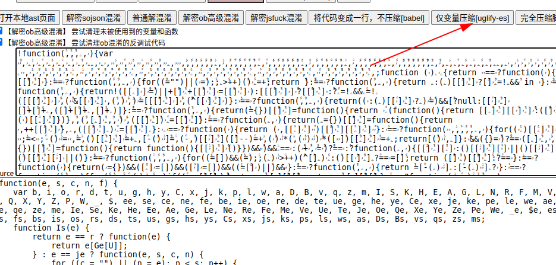
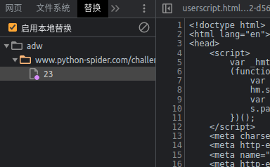
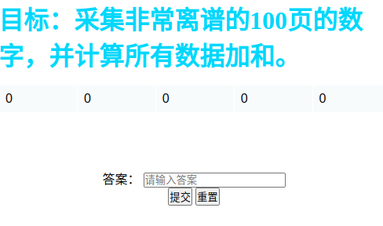
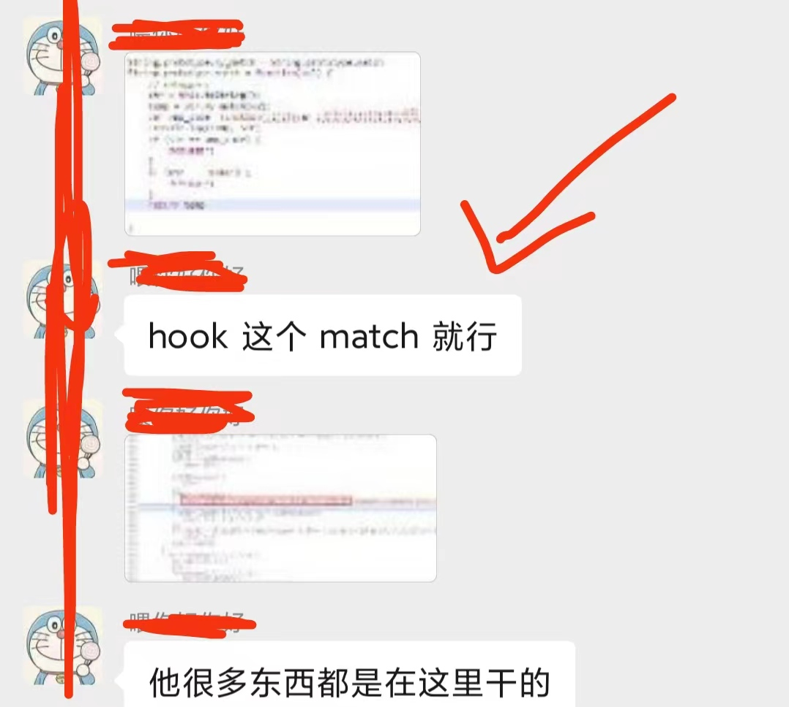
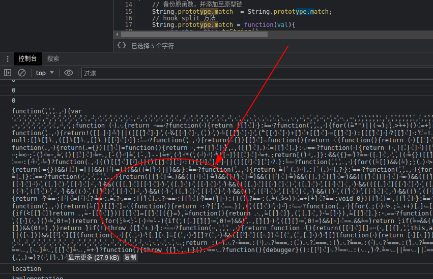

# 知识点：hook match函数、main.wasm加密、protobuf对象数据、jsvmp混淆

## 解题思路

首先查看请求地址内容，发现请求数据和返回数据都是二进制数据


跟栈进入js调试，发现是蝌蚪纹，变量名称完全看不明白，尝试用`V_jstools`解码。



通过`V_jstools`解码后，就可以清楚的看到变量名称



浏览器启用本地替换的方式



发现报错，数据直接不显示了，这里我猜测是代码格式化检测或者是蝌蚪纹检测



花了几个小时搞不定，没办法了，**搜索内部群的聊天记录**，找到如下答案，`hook match`，看到这大概明白了代码检测是通过`match`正则匹配的方式。



利用油猴插件编写hook补丁，并打印出`match`匹配的字符串内容`console.log(str);`

```javascript
// ==UserScript==
// @name        hook match
// @namespace   http://tampermonkey.net/
// @version     0.1
// @description pass
// @author      ayf
// @run-at      document-start
// @match        *://www.python-spider.com/*
// @grant       none
// ==/UserScript==

(function () {
    // 备份原函数，并添加至原型链
    String.prototype.match_ = String.prototype.match;
    // hook split 方法
    String.prototype.match = function(val){
        var str = this.toString();
        console.log(str);
        console.log(val);
        if(str.indexOf("function") != -1){
            console.log(str);
            console.log(val);
            debugger;
            return null;
        }
        return str.match_(val);
    }
    // 过检测
    String.prototype.match.toString = function (){
        return "function split()  [native code] ";
    }
})();
```

刷新浏览器运行网页，看看我发现了什么内容！


