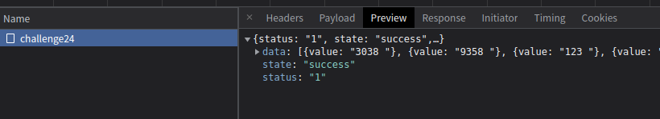
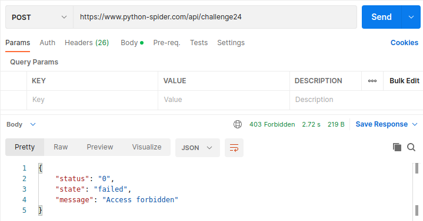
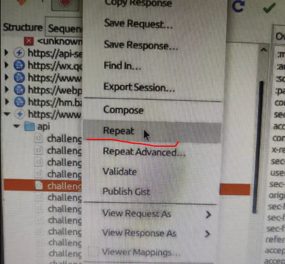
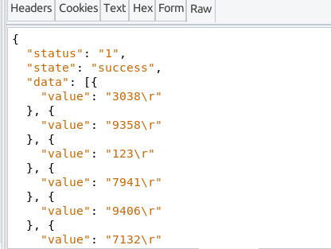
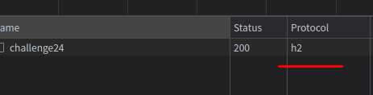

# 知识点： 禁止`http1.0`的所有请求

## 解题思路

打开控制台查看返回的数据，数据是正常显示的

用`postman`测试一下， `Access forbidden` 禁止访问

这里第一个反应是测试重放攻击，利用抓包软件测试

能正常返回数据

在回到控制台查看请求，发现是`h2`

将请求代码改写成`http2.0`方式发送请求就ok了

    from hyper.contrib import HTTP20Adapter
    import requests
    session = requests.session()
    session.headers = headers
    session.mount(url, HTTP20Adapter())
