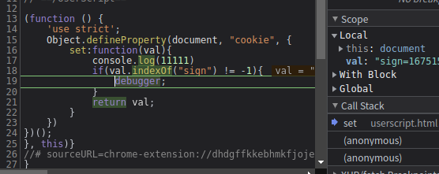
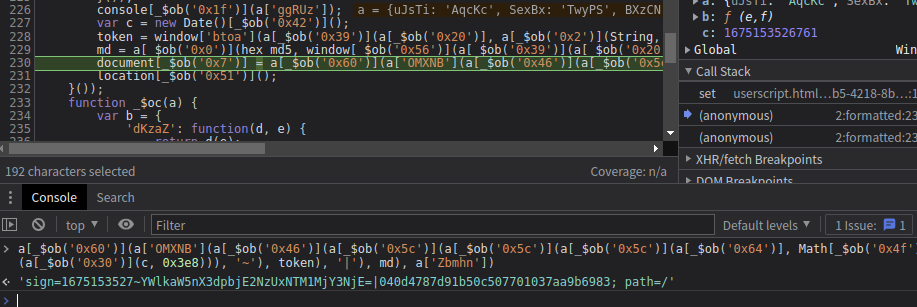
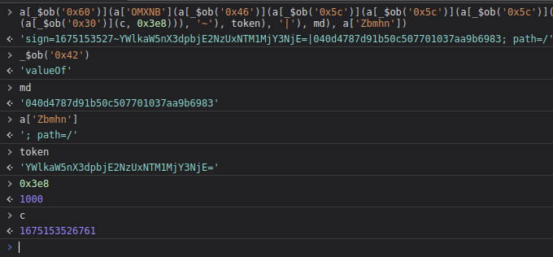

# 知识点：通过`hook`网站`cookie`确定加密位置

    // ==UserScript==
    // @name        Hook Cookie
    // @namespace   http://tampermonkey.net/
    // @version     0.1
    // @description pass
    // @author      ayf
    // @run-at      document-start
    // @match        *://www.python-spider.com/*
    // @grant       none
    // ==/UserScript==

    (function () {
        'use strict';
        Object.defineProperty(document, "cookie", {
            set:function(val){
                console.log(11111)
                if(val.indexOf("m") != -1){
                    debugger;
                }
                return val;
            }
        })
    })();

刷新网页打断点

断点调试，进入下一层，这里就能确定`sign`的位置

    var c = new Date()[_$ob('0x42')]();
    token = window['btoa'](a[_$ob('0x39')](a[_$ob('0x20')], a[_$ob('0x2')](String, c)));
    md = a[_$ob('0x0')](hex_md5, window[_$ob('0x56')](a[_$ob('0x39')](a[_$ob('0x20')], a[_$ob('0x0')](String, Math[_$ob('0x4f')](a[_$ob('0x36')](c, 0x3e8))))));
    document[_$ob('0x7')] = a[_$ob('0x60')](a['OMXNB'](a[_$ob('0x46')](a[_$ob('0x5c')](a[_$ob('0x5c')](a[_$ob('0x5c')](a[_$ob('0x64')], Math[_$ob('0x4f')](a[_$ob('0x30')](c, 0x3e8))), '~'), token), '|'), md), a['Zbmhn']);

这里可以看到代码被ob混淆了，利用控制台一点点的还原变量比如。

    var c = new Date()[_$ob('0x42')]();

还原

    var c = new Date()['valueOf']();

以此类推此题就解决了