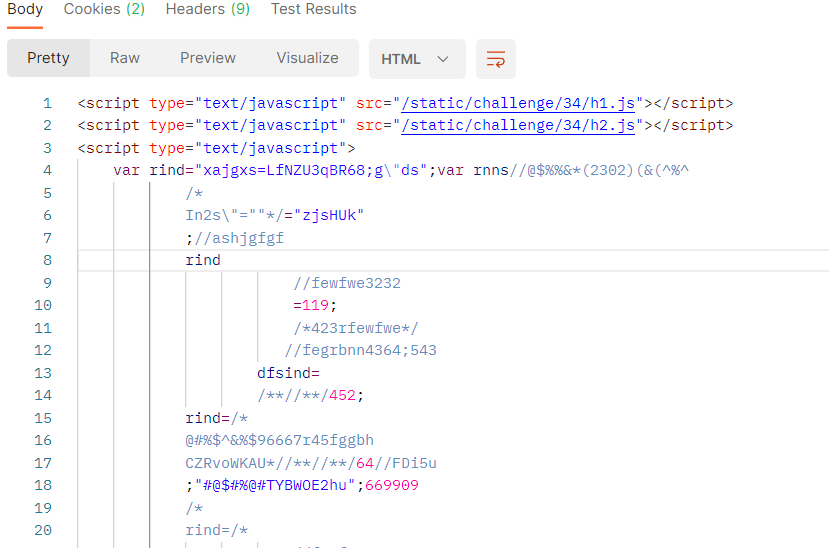
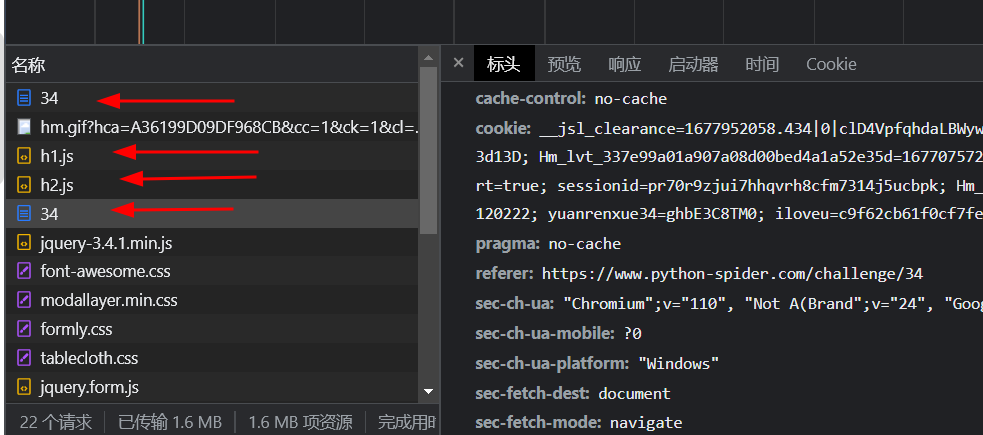
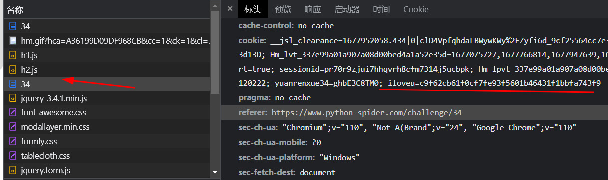
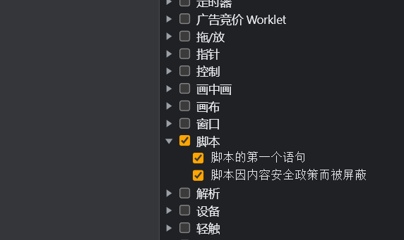
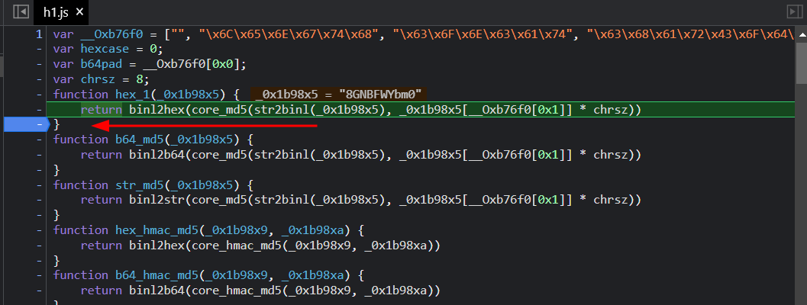
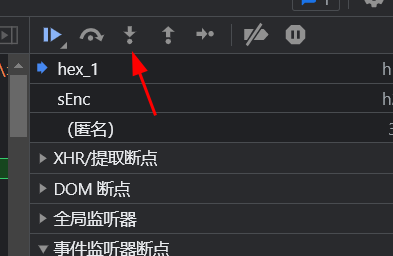
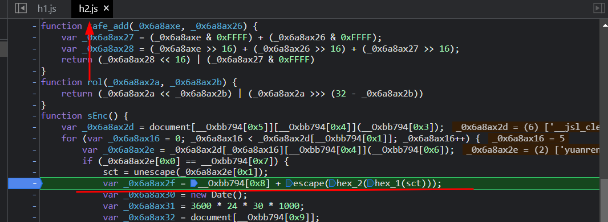
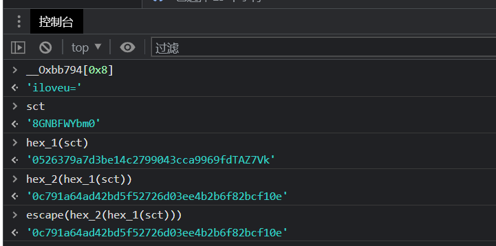

# 知识点： 补环境，事件断点，轻度混淆

## 解题思路

打开控制台,请求发现返回一串js代码

再观察控制台请求顺序

查看2个请求地址有何区别，多了个`iloveu`

这时需要用到，事件脚本断点

断点下一步，下一步，下一步直到h1停下来，继续打上断点

在点进入下一个断点

这时候就进入了h2函数里面

可以看到代码

    var _0x6a8ax2f = __Oxbb794[0x8] + escape(hex_2(hex_1(sct)));

尝试控制台打印函数结果值

到这里基本上就搞定了`iloveu`值的来源，接下来的事情就是扣代码补环境了

以下就是`h1.js`需要补的环境

    navigator = {
        'userAgent': 'Mozilla/5.0 (X11; Linux x86_64) AppleWebKit/537.36 (KHTML, like Gecko) Chrome/101.0.0.0 Safari/537.36',
        'plugins': {
            'length': 5
        }
    };
    
    window = global;
    document = {
        'execCommand': function () {
            return true
        },
        'createElement': function () {
            return true
        }
    };

`h2.js`的话，直接运行就可以了，没有设置多余门槛。

