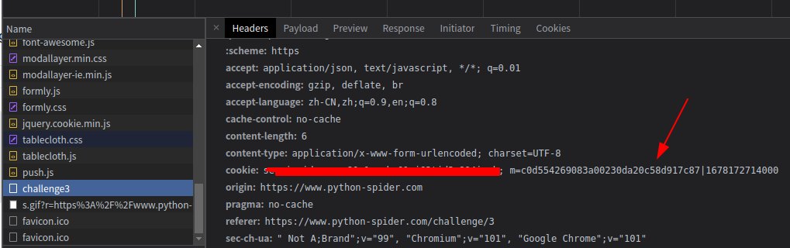
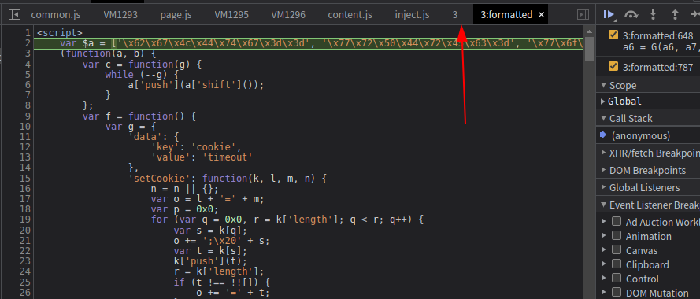
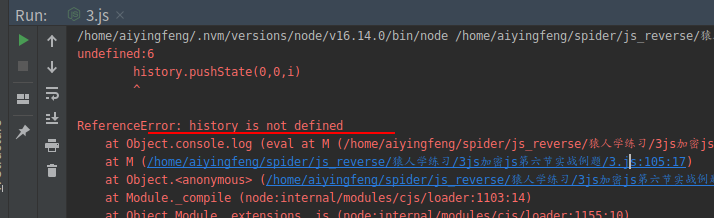

# 知识点：sojson解密，headers检测，动态cookie

## 解题思路

控制台查看发现cookie中存在`m`的变量,值是加密的

经过几次的请求尝试，发现变量`m`是通过`https://www.python-spider.com/challenge/3`地址请求过后生成的

接下来事件断点

老规矩下一步，下一步，下一步，到`https://www.python-spider.com/challenge/3`停下来，可以看到js代码存在混淆

利用google插件v_jstools进行解混淆

复制解混淆后的js代码，尝试运行，去除头尾的匿名函数运行

这里的报错的原因是一段`eval(L(qz))`代码,尝试打印`console.log(L(qz));`

打印结果是

    console = new Object()
    console.log = function (s) {
        while (1){
            for(i=0;i<1100000;i++){
            history.pushState(0,0,i)
                }
        }

    }
    console.toString = '[object Object]'
    console.log.toString = 'ƒ toString() { [native code] }'

我的操作简单粗暴，直接注释不执行

再看接下来的代码，返回的是`navigator.vendorSub;`,这里就是空

    try {
        if (global) {
            console.log("人生苦短，何必python？");
        } else {
            while (1) {
                console.log("人生苦短，何必python？");
                debugger;
            }
        }
    } catch (a5) {
        console.log(a5);
        return navigator.vendorSub;
    }

改写成

    return '';

代码最后，这些也同样注释掉

    function W(Y, Z) {
        document.cookie = "m" + M() + "=" + V(Y) + "|" + Y + "; path=/";
        location.reload();
    }

    function X(Y, Z) {
        return Date.parse(new Date());
    }

    W(X());

替换成

    m = V(1678168607000);
    console.log(m);

