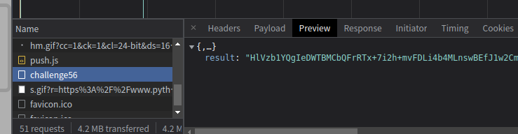
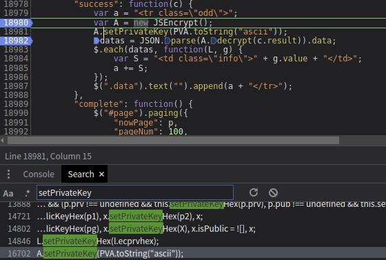
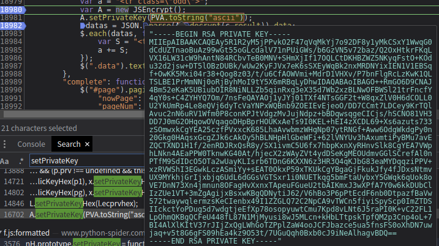

# 知识点： RSA加密

## 解题思路

RSA是非对称加密算法，非对称加密算法指的是加密和解密使用不同的密钥，除了加解密的作用，还有“签名”的作用。通常来说非对称加密比对称加密要耗时间。

查看请求返回内容，发现结果加密

由于此题已经说明是RSA加密，这里搜索解密关键词`setPrivateKey`

发现`A.setPrivateKey(PVA.toString("ascii"))`;就是设置了私钥

控制台直接打印出私钥

私钥已经找到了，解密就是写代码的时间问题了