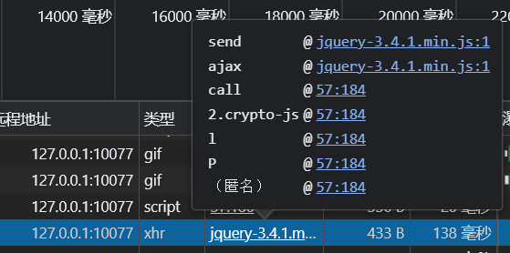
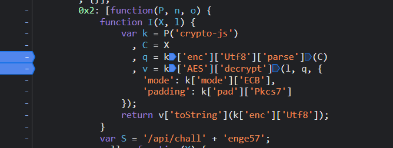
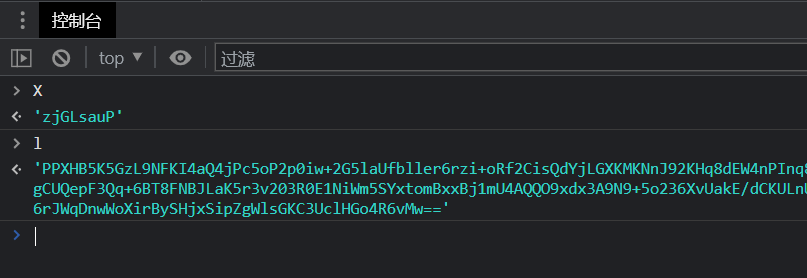
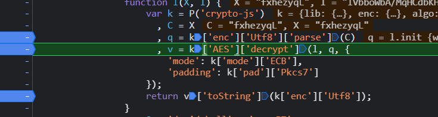
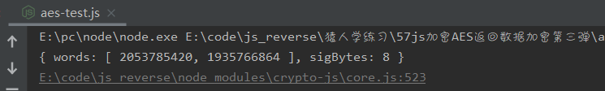
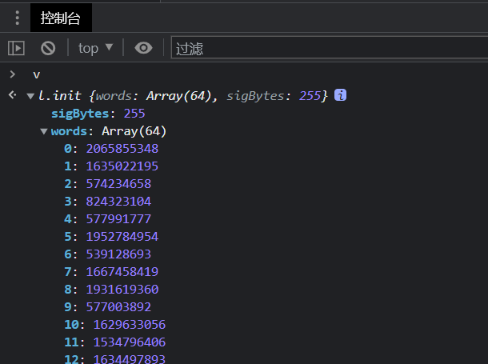
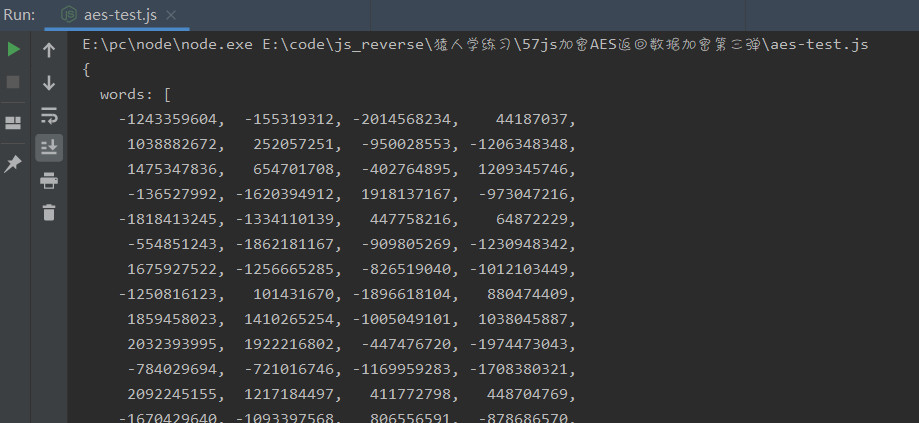

# 知识点： DES加密,重写加密函数

## 解题思路

请求查看结果地址，发现是结果加密

进入调试

打断点,发现是`crypto-js`加密

利用控制台查看变量值

既然知道了`crypto-js`加密

    var k = P('crypto-js')
      , C = X
      , q = k['enc']['Utf8']['parse'](C)
      , v = k['AES']['decrypt'](l, q, {
        'mode': k['mode']['ECB'],
        'padding': k['pad']['Pkcs7']

编写js代码

    const CryptoJS = require("crypto-js");
    
    function I(X, l) {
        var k = CryptoJS
            , C = X
            , q = k['enc']['Utf8']['parse'](C)
            , v = k.AES.decrypt(l, q, {
            'mode': k['mode']['ECB'],
            'padding': k['pad']['Pkcs7']
        });
        return v['toString'](k['enc']['Utf8']);
    }
    
    X = "lVyahWFq";
    L = "ohKADHk8zYXczliObcRsvE70kmTI2RiN94ZOxQgxbhQ7pueMCCcH7mnDZU2Tj2KwP0cqYgzsflRzt/Qls+efrZtGFaLomQw24v9FvIOso6lMYKrKtw5qP3b8d13G1tQXIuHILMMXDSrtUjX3vV+nUl7lV8KebHccY0STT0un12bMkODx2FTcv93sn2UHoBMTIWBM3CY+cQpOYEYB7iovImwasNLA5vsYxgntDuyxubvP5oi7FZPvHqtThy3gw9ivk+MyCBpW21Gr2aF/Wz/BHA10B5alDqSzP0cqYgzsflQCxHiUkgI+FptGFaLomQw2T1hUihgNUvLYnFuUWRJ6sw==";
    
    console.log(I(X, L));

执行发现，报错

    Error: Malformed UTF-8 data

猜是魔改过的`CryptoJS`,下面进行单步调试

控制台打印`q`

本地打印，输出值相同，没有问题

继续调试

控制台打印`v`

本地打印，输出值不相同

经过多次调试，发现是 k.AES.decrypt 存在魔改

    v = k.AES.decrypt(l, q, {
            'mode': k['mode']['ECB'],
            'padding': k['pad']['Pkcs7']
        }

应该是`DES`重写了`AES`函数，

    k.DES.decrypt