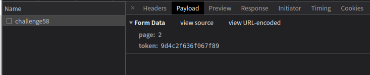
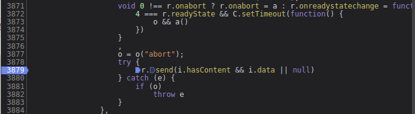
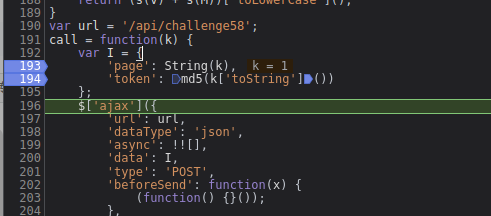
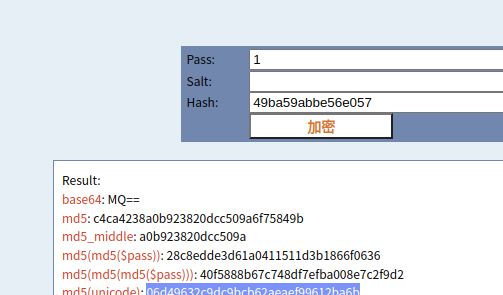

# 知识点： md5的16位加密

## 解题思路

观察请求内容，发现存在固定的token值

跟值进入js中发现代码`i.hasContent && i.data || null`,这断代码最终执行`i.data`

继续控制调试，发现此断代码`md5(k['toString']())`，传入的是k的字符串，而k是页码

这里可以利用在线md5工具比对加密结果

问题解决是md5的16位加密