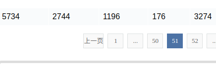
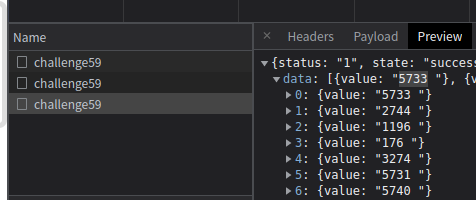
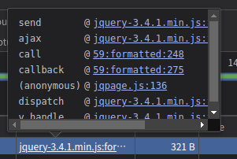
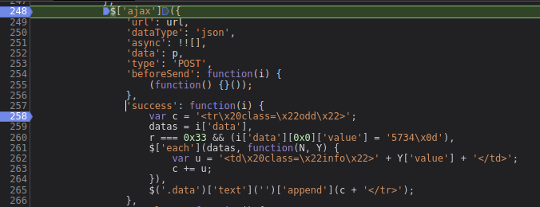
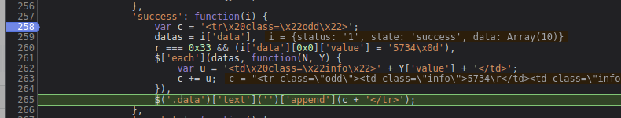

# 知识点：细心，读懂js代码

## 解题思路

查看接口返回数据发现51页，页面显示的第一个数字是5734

接口返回的数字是5733

查看js执行流程

其中以下函数不是由	jquery 执行，脏数据的产生应该就在以下逻辑中

        call	@	59:formatted:248
    callback	@	59:formatted:275
    (anonymous)	@	jqpage.js:136

打上断点，调试程序

很快就能找到`success`返回值，关键代码如下

    r === 0x33 && (i['data'][0x0]['value'] = '5734\x0d')

改写一下

    r === 51 && (i['data'][0]['value'] = '5734\x0d')

当`r === 51`时执行`(i['data'][0]['value'] = '5734\x0d')`

