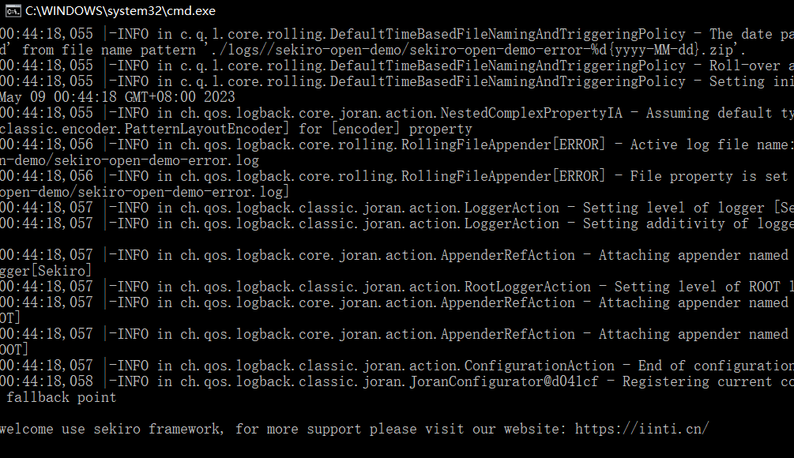
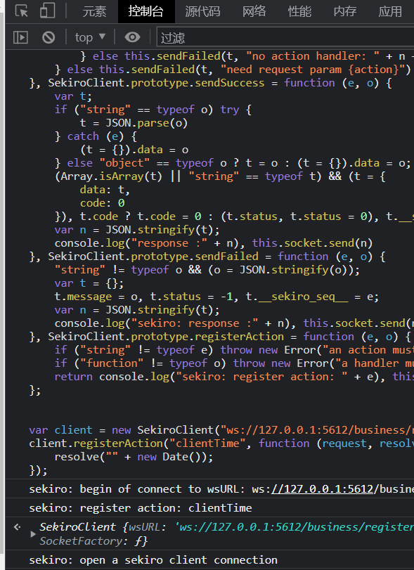
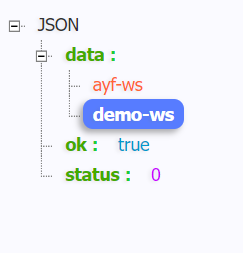

# 知识点：sekiro rpc框架
1. https://sekiro.iinti.cn/sekiro-doc/01_user_manual/1.quickstart.html#%E6%B5%8F%E8%A7%88%E5%99%A8js%E7%8E%AF%E5%A2%83
2. https://blog.csdn.net/qq_43502467/article/details/129456814

## 简单测试
安装sekiro rpc框架

    https://oss.iinti.cn/sekiro

运行启动脚本

    bin/sekiro.sh :mac or linux
    bin/sekiro.bat :windows
    

编写注入浏览器的代码

./test.js 文件

将`test.js`文件中js注入到浏览器中

浏览器打开如下地址

    http://127.0.0.1:5612/business/groupList
 
可以看到当前系统有哪些注册过的group
 

通过js注入把网页数据反回给接口

    http://127.0.0.1:5612/business/invoke?group=ayf-ws&action=clientTime

## 解题

vip视频14

