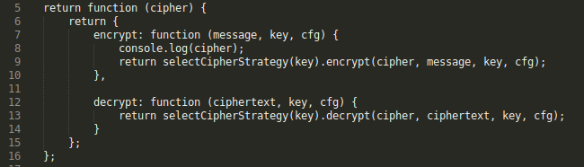
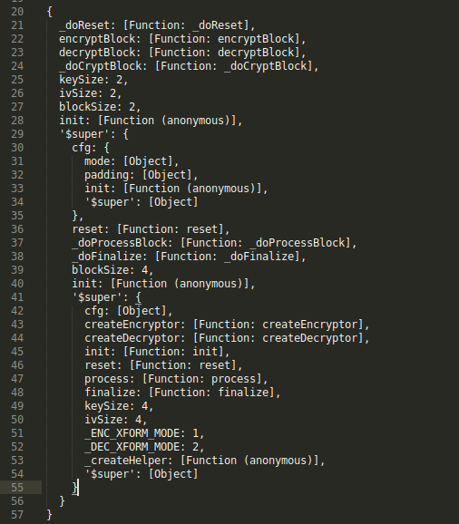

# 知识点： DES加密,重写加密函数

## 解题思路

类似 [57题](https://github.com/luzhisheng/js_reverse/tree/master/%E7%8C%BF%E4%BA%BA%E5%AD%A6%E7%BB%83%E4%B9%A0/57js%E5%8A%A0%E5%AF%86AES%E8%BF%94%E5%9B%9E%E6%95%B0%E6%8D%AE%E5%8A%A0%E5%AF%86%E7%AC%AC%E4%B8%89%E5%BC%B9)

练习平台的57和60题都是重写AES加密替换成了DES

我用nodejs的打印了crypto-js的cipher变量

DES是

AES是

做这两道题搞了很久，我只有去对比对象属性值是否相同，但我不理解其真实含义，有没有更好的解题思路。

