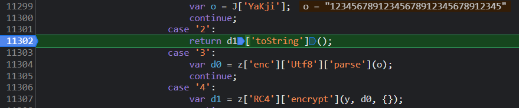
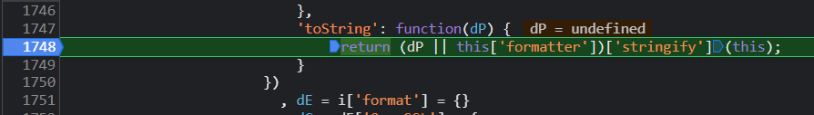
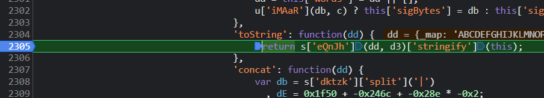
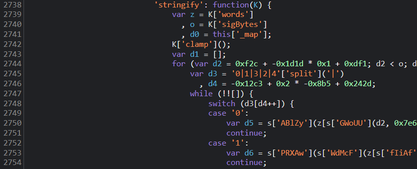
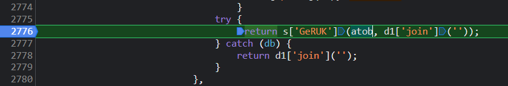
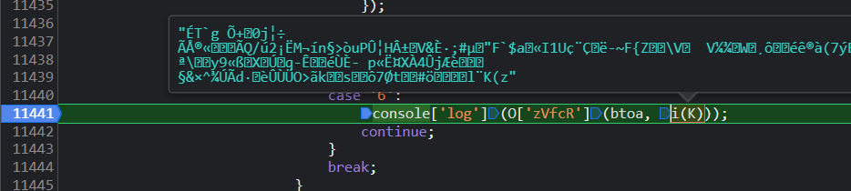
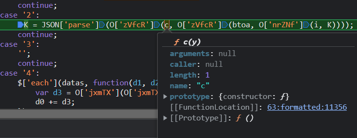
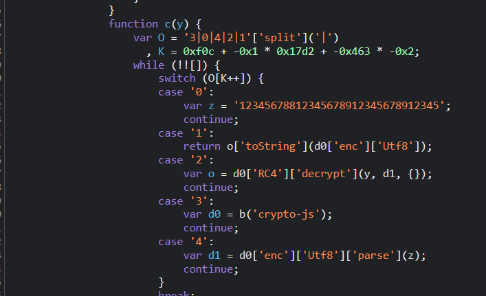

# 知识点：返回数据二进制 atob btoa crypto crypto-js

## 解题思路
查看请求结果，发现是乱码

### 请求体乱码

打断点找到请求体加密点发现

代码是

    code = s(J['lzaCv'](J['qromH'](j, -0xb31 + 0x53 * -0x42 + 0x4b1 * 0x7), y['toString']()))

改写

    code = s(j(64) + 1);

进入j函数

发现是 `window['crypto']['getRandomValues']` 进行的加密这里需要用到

    const crypto = require('crypto').webcrypto;

得到一串加密字段

接下来就是`s`函数。通过`s`函数能得到请求体中乱码值

这里用的是 `crypto` 的`RC4`加密,

但是`RC4`加密结果不会出现乱码，尝试继续跟进代码看看具体原因

这里跟近我是直接通过 `return` 关键词一步步断点进入

`return` 断点1

`return` 断点2

`return` 断点3

`return` 断点4

`return` 断点5，这里就发现`atob`方法，即`Base64`的解码过程

控制台输出

### 返回体乱码

既然已经知道加密用的是`atob`,那么解码会不会是`btoa`，继续调试

`btoa`即Base64的编码过程

在通过调试，发现`c`函数是`crypto-js`加密

到这里就基本结束了

