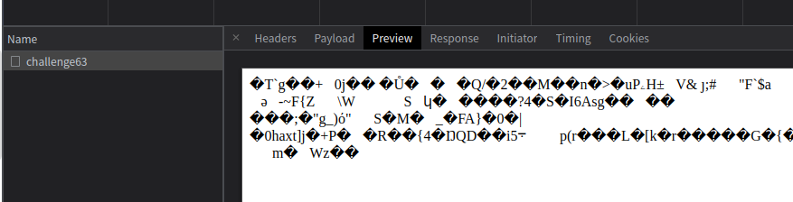
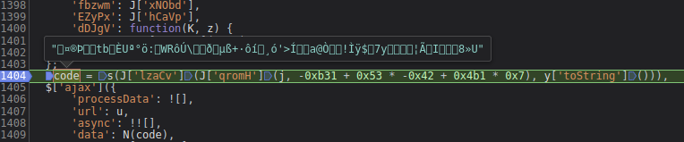
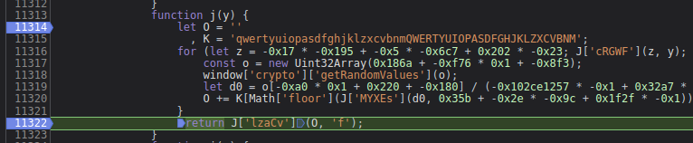
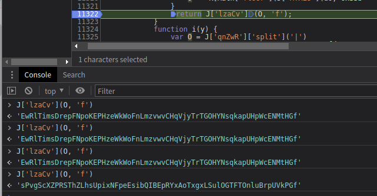
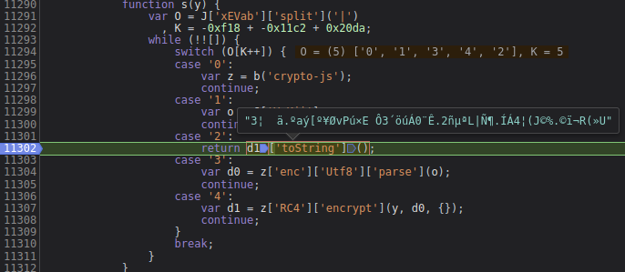

# 知识点：返回数据二进制 atob btoa crypto

## 解题思路
查看请求结果，发现是乱码

请求体也是乱码

打断点找到请求体加密点发现

代码是

    code = s(J['lzaCv'](J['qromH'](j, -0xb31 + 0x53 * -0x42 + 0x4b1 * 0x7), y['toString']()))

改写

    code = s(j(64) + 1);

进入j函数

发现是 `window['crypto']['getRandomValues']` 进行的加密这里需要用到

    const crypto = require('crypto').webcrypto;

得到一串加密字段

接下来就是s函数。通过s函数能得到请求体中乱码值

这里用的是 `crypto-js` 的`RC4`加密,