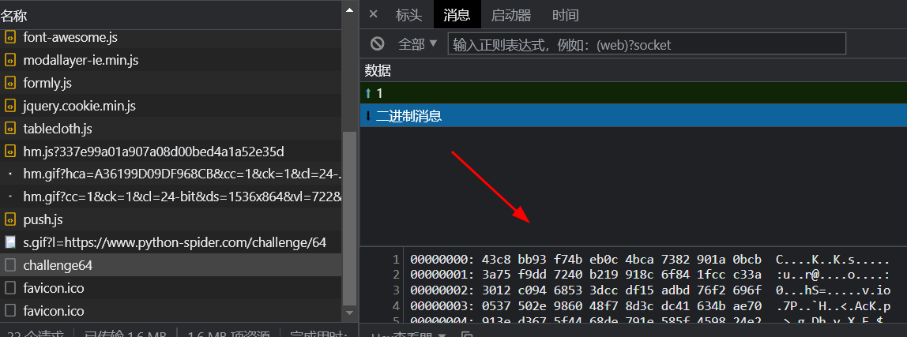
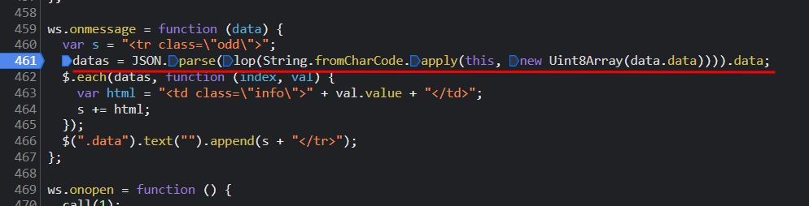
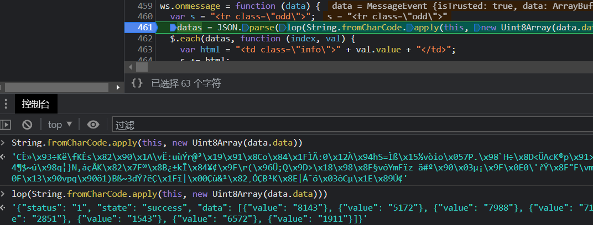
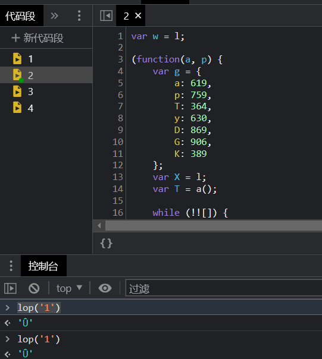
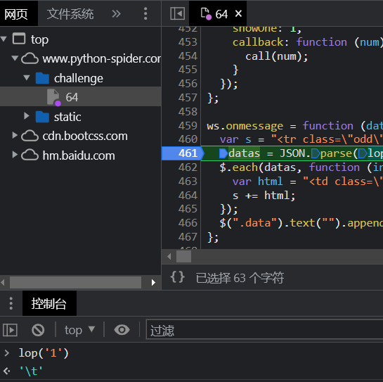
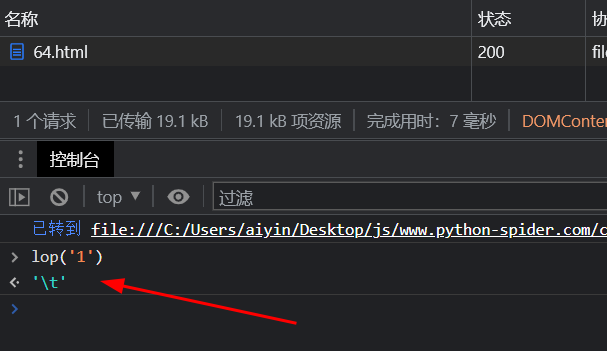
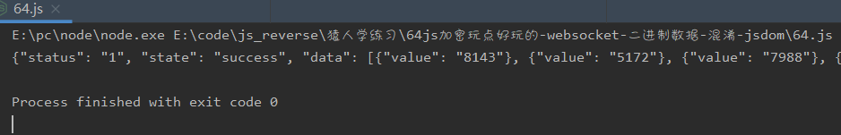
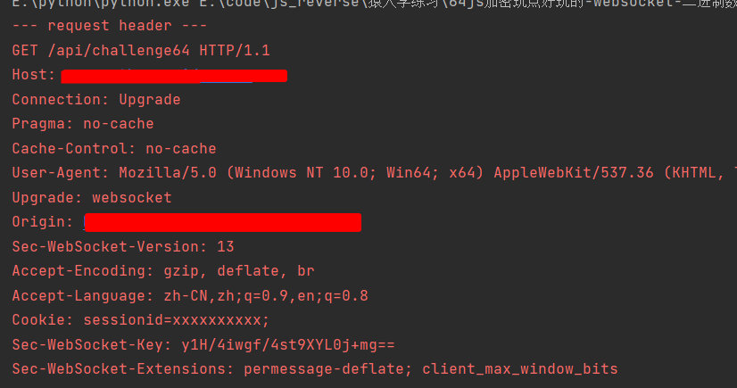

# 知识点：返回数据二进制，websocket，混淆，jsdom，代码格式化检测(((.+)+)+)+$

## 解题思路

### lop函数解密

查看请求地址发现是`websocket`连接，返回的数据如下

进入js查看代码逻辑

断点调试看看，`lop`函数对二进制数据进行了解密

尝试扣下代码在本地执行，输入一个字符串1作为值，用来校验返回值`'Û'`

正确的返回值`'\t'`

尝试通过建立一个html文件在浏览器执行，判断`lop`函数解密是否正确

浏览器打开，控制台执行`lop('1')`，发现返回内容正确

接下来利用`jsdom`尝试解密函数

    const jsdom = require("jsdom");
    const {JSDOM} = jsdom;
    const fs = require("fs");
    window = global;
    
    
    let token = null;
    
    const getTokenFromServer = async function (data) {
        let a = data;
        return new Promise((resolve,reject)=>{
            fs.readFile('./jsdom.html', 'utf8', function (err, data) {
                const dom = new JSDOM(data,
                    {
                        url: "https://www.python-spider.com/challenge/64",
                        referrer: "https://www.python-spider.com/challenge/64",
                        contentType: "text/html",
                        includeNodeLocations: true,
                        storageQuota: 10000000,
                        runScripts: "dangerously"
                    }
                );
                res = dom.window.lop(a);
                dom.window.close();
                resolve(res);
            });
        })
    };

    data = 'CÈ»\x93÷Kë\fKÊs\x82\x90\x1A\vË:uùÝr@²\x19\x91\x8Co\x84\x1FÌÃ:0\x12À\x94hS=Ìß\x15­½vòio\x057P.\x98`H÷\x8D<ÜAcK®p\x91>Óg_DhÞy\x1EX_E\x98$â¡PÖîüEE÷®<\n>uél\x02\x9DêÄ[2\x14¶$~ú\x98q¦}N,áçÅK\x82\x7F®\x8B¿±kÎ\x84¥¢\x9F\r(\x96Ü;Q\x9D>\x18\x98\x8F§vóYmFïz ã#º\x90\x03µ¡\x9F\x0E0\'?Ý\x8F"F\vmÚþ\x9C\x9E\x9CðBÔ\x88Õ\x10\x8Cc\x9E¾\x92à¥\x88¿ºú\x0F\x13\x90vpq\x90ö1)Bß~3dÝ?êÇ\x1Fî|\x00Çù&¹\x82¸ÓÇB¹K\x8E|Á¯õ\x03òCµ\x1E\x89Ú¢'
    getTokenFromServer(data);

打印效果

### python的websocket不支持自定义headers请求头

重写websocket包的get_handshake_headers函数

    from websocket import _handshake

    def get_handshake_headers(resource, url, host, port, options):
        headers = ['GET /api/challenge64 HTTP/1.1', 'Host: www.python-spider.com', 'Connection: Upgrade',
                   'Pragma: no-cache', 'Cache-Control: no-cache',
                   'User-Agent: Mozilla/5.0 (Windows NT 10.0; Win64; x64) AppleWebKit/537.36 (KHTML, like Gecko)'
                   ' Chrome/113.0.0.0 Safari/537.36',
                   'Upgrade: websocket', 'Origin: https://www.python-spider.com', 'Sec-WebSocket-Version: 13',
                   'Accept-Encoding: gzip, deflate, br', 'Accept-Language: zh-CN,zh;q=0.9,en;q=0.8',
                   'Cookie: sessionid=xxxxxxxxxx;', 'Sec-WebSocket-Key: y1H/4iwgf/4st9XYL0j+mg==',
                   'Sec-WebSocket-Extensions: permessage-deflate; client_max_window_bits', '', '']
        key = 'y1H/4iwgf/4st9XYL0j+mg=='
        return headers, key
    
    
    _handshake._get_handshake_headers = get_handshake_headers

看一下自定义的headers请求头

### 注意点

格式化代码的时候浏览器会卡死，解决方法：
    
    https://www.cnblogs.com/kai-/p/16935788.html