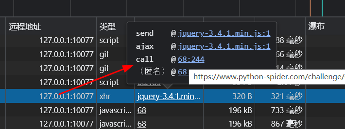
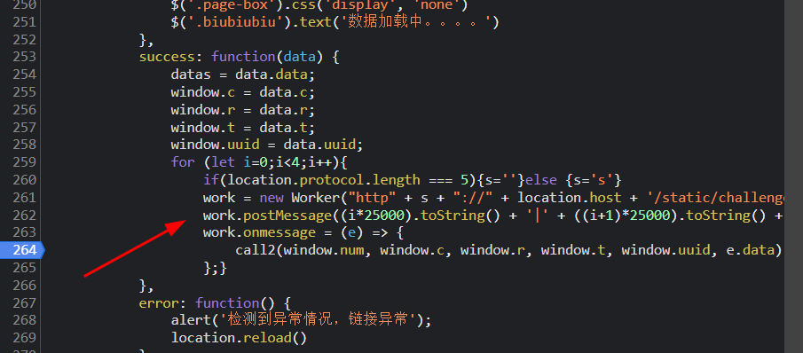
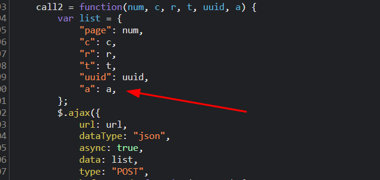
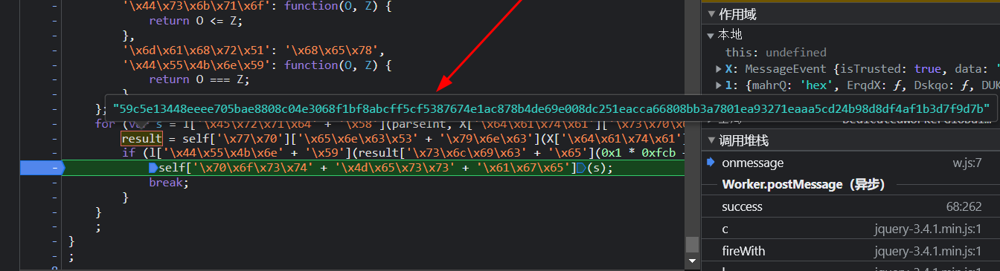
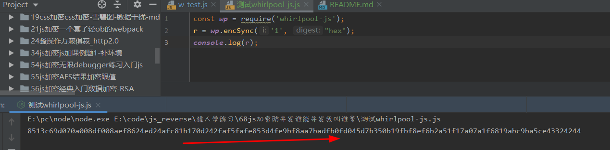

# 知识点： whirlpool-js加密，ob混淆，worker多线程，headers检测

worker多线程在js基础课21有讲解

## 解题思路

看控制台返回的内容

查看请求参数，发现如下图字段

通过搜索发现找到了c,r,t,uuid,但是a是什么,目前不清楚

进入调试控制台，查看js内容

发现一段可疑代码是`Worker`和`call2(window.num, window.c, window.r, window.t, window.uuid, e.data)`

通过搜索`call2`对应了ajax请求

那么这个`e.data`应该就是要找的a，而这个e是通过`Worker`的线程返回的

进入线程调试，大量ob混淆，此地无银二百两，a的加密就在这里了

直接用工具解ob混淆

解混淆后在代码尾部找到了`onmessage`仔细阅读代码

    onmessage = X => {
      for (var s = parseInt(X.data.split("|")[0]); s <= parseInt(X.data.split("|")[1]); s++) {
        result = self.wp.encSync(X.data.split("|")[2] + s.toString(), "hex");
    
        if (result.slice(0, 10) === X.data.split("|")[3]) {
          self.postMessage(s);
          break;
        }
      }

其中最最重要的一句是`if (result.slice(0, 10) === X.data.split("|")[3])`如果`result`结果前10个字符串全等`X.data.split("|")[3]`
就跳出循环，并子线程发送数据给主线程`self.postMessage(s)`，那么`result`是怎么来的，通过`self.wp.encSync(X.data.split("|")[2] + s.toString(), "hex");`得到

现在的问题就是如何得到`result`，是通过函数`self.wp.encSync`得到

在看解混淆后的代码，发现代码的尾部有这样的包`whirlpool-js`，这个包下面存在`.encSync`

在npm文档中解释是这样的，地址https://www.npmjs.com/package/whirlpool-js

    whirlpool 512 bit hash in javascript for electron and the browser
    Demo: https://angeal185.github.io/whirlpool-js

看解释应该是一个加密包，下面的问题就是此加密包是否魔改过？

先在控制尝试输出1的加密结果

再自己写一个原生的处理结果

一模一样，到这里主要的问题点就已经解决了。

## 注意点

在调试ob混淆的时候，我尝试本地替换成解过混淆的代码，但是程序直接卡住不动，其原因在这里

做了格式化检测，简单翻译如下

      var K = O["xwRkz"](Z, this, function () {
        return K["toString"]()["search"]("(((.+)+)+)+$")["toString"]()["constructor"](K)["search"](O["ptdii"]);
      });

相关文章介绍 https://www.cnblogs.com/kai-/p/16935788.html
