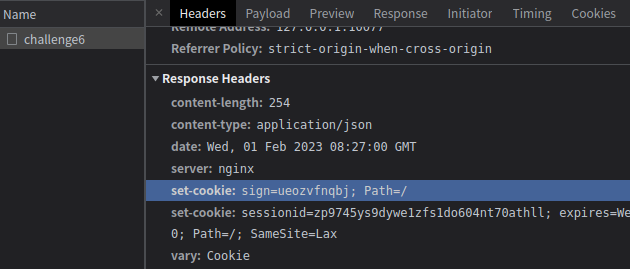

# 知识点：`session`存在`set-cookie`中

## 解题思路

既然题目已经告诉你了是`session`问题，直接看请求内容

发现response中存在`set-cookie`内容

    set-cookie: sign=ueozvfnqbj; Path=/
    set-cookie: sessionid=zp9745ys9dywe1zfs1do604nt70athll; expires=Wed, 01 Feb 2023 14:27:00 GMT; HttpOnly; Max-Age=2160

将`sign`和`sessionid`添加到下一个请求中，这题就解决了