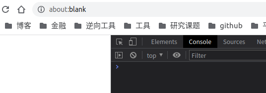
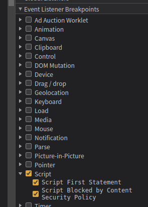
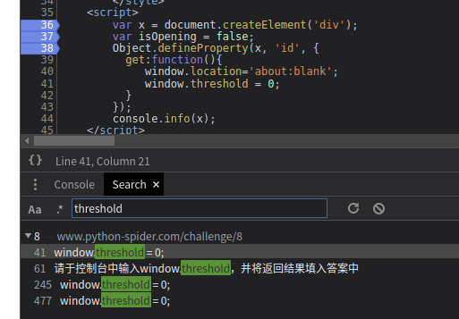
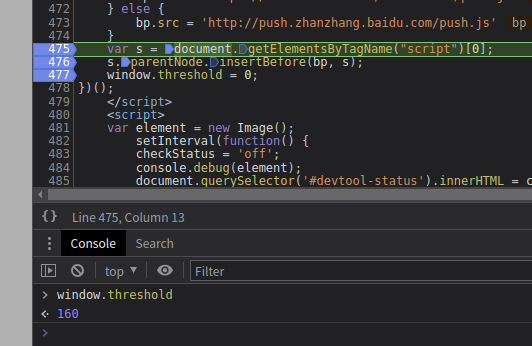

# 知识点：控制台js加载事件监控

## 解题思路

打开控制台，网站就直接跳转到新的地址

这里直接监听js执行事件

断点出现后搜索`threshold`打上断点，如果有多处，多打几个断点，最后去掉监听js执行事件重新运行

另外一处断点

一次次尝试，在如下断点出

    var s = document.getElementsByTagName("script")[0];

顺利得到`window.threshold`值