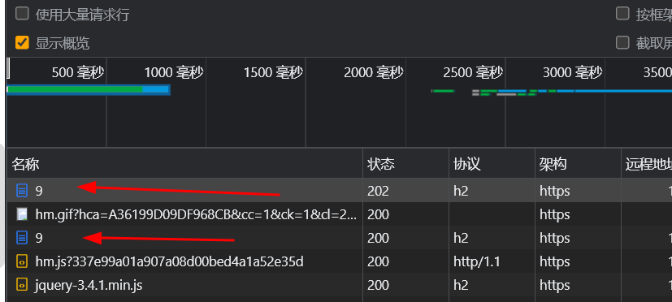
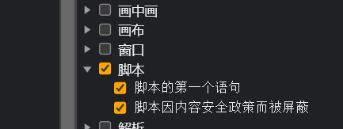
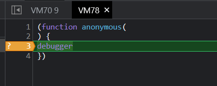
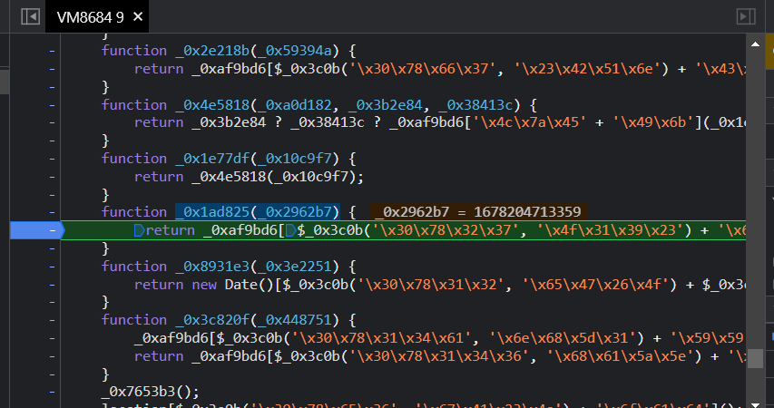
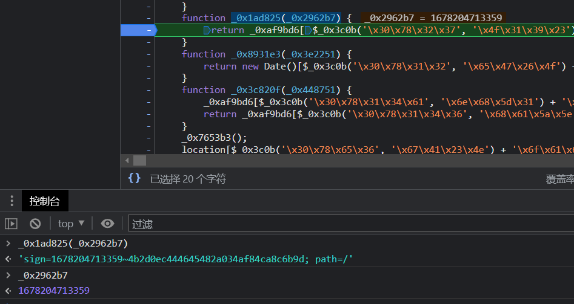
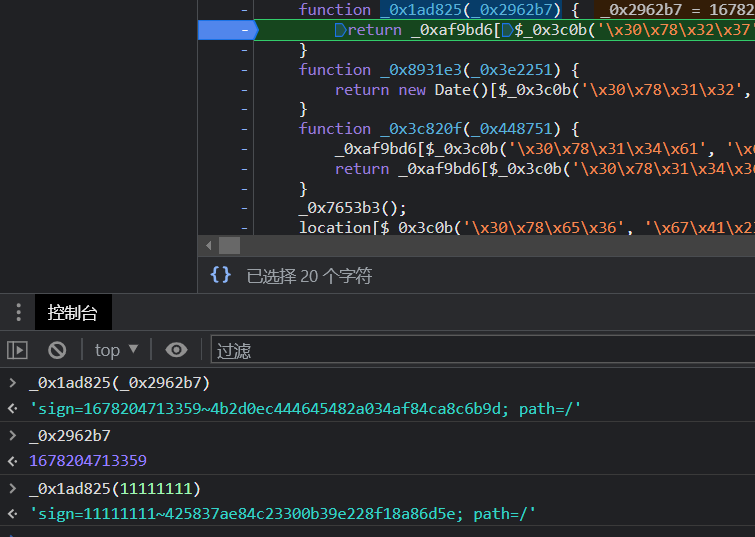

# 知识点：debugger, 混淆

## 解题思路

控制台查看请求顺序，发现`cookie`是`https://www.python-spider.com/challenge/9`生成的

事件断点

过掉debugger

进入虚拟空间

由于题目是

    还是一个复杂的混淆，老规矩，还是计算sign，时间为：1589023846363，对应的sign是

这里我简单粗暴一下，多次断点，找到函数`_0x1ad825(_0x2962b7)`，尝试打印

那么这里我把变量`_0x2962b7`修改成1589023846363，是不是此题就搞定了

经过测试成功解决