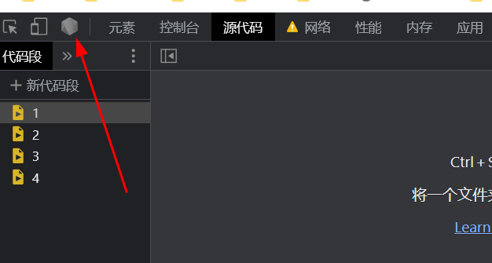
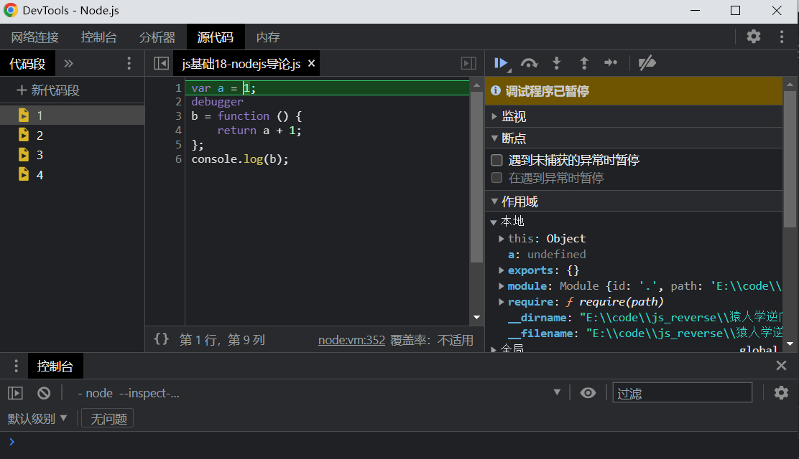

# 知识点：

## 使用node-inspect 调试线上 nodejs 应用

先安装`inspect`库

    npm install -g node-inspect

创建一个js文件`js基础18-nodejs导论.js`

    var a = 1;
    debugger
    b = function () {
        return a + 1;
    };
    console.log(b);

启动

    node --inspect-brk 猿人学逆向学习/js基础18-nodejs导论/js基础18-nodejs导论.js

打开浏览器控制台左上角的nodejs开发工具

效果图

